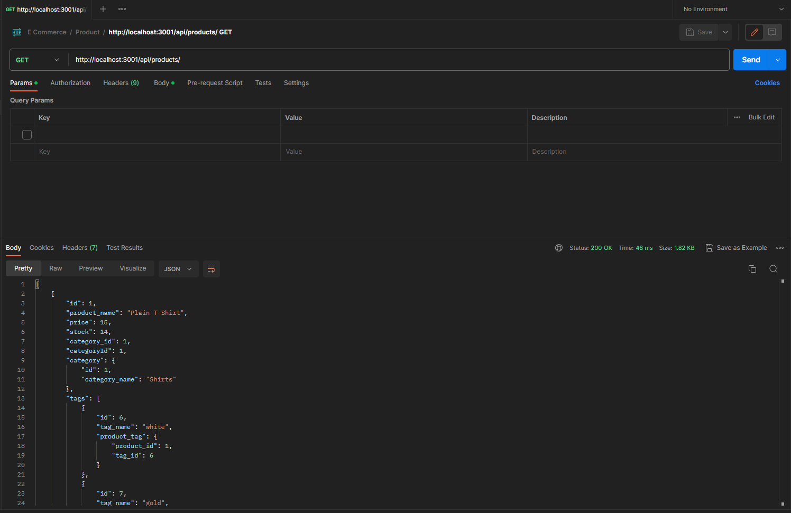
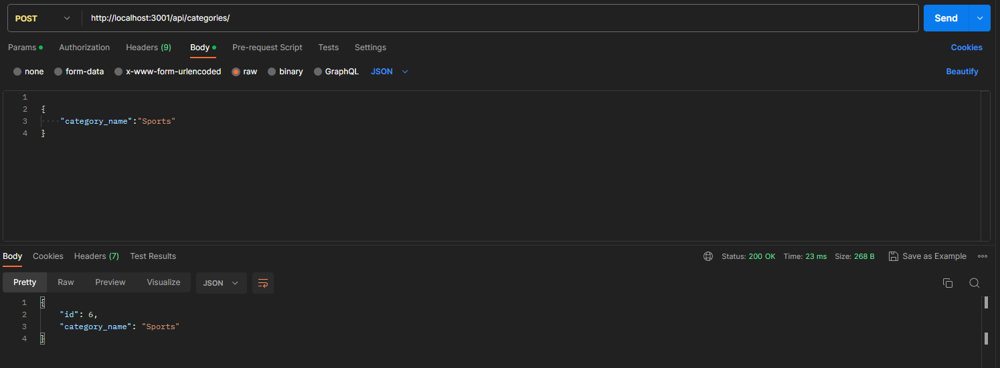
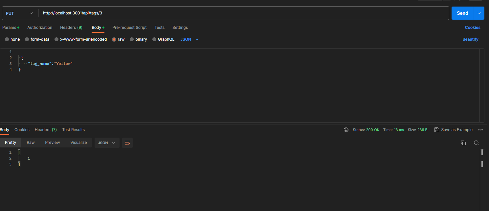
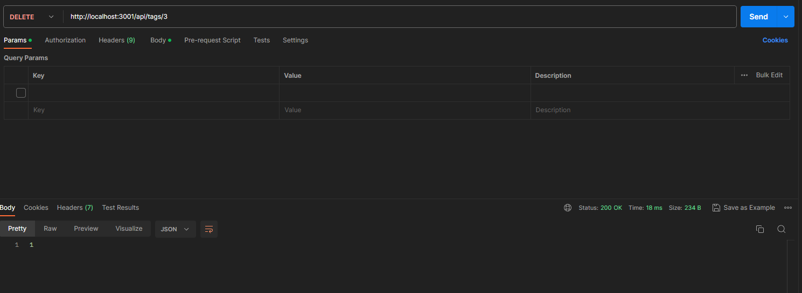

# E-Commerce-Backend-ORM

Creating a E-Commerce Backend with the use of ORM's using Sequelize

## Table of Content

- [Walkthrough](#walkthough)
- [User Story & Acceptance Criteria](#user-story)
- [What I have learnt](#what-i-have-learnt)
- [Installation](#installation)
- [Test](#test)
- [Usage](#usage)

## Walkthough

[Walkthrough Video](https://youtu.be/9kfN7-r2eCE)

## User Story

```md
AS A manager at an internet retail company
I WANT a back end for my e-commerce website that uses the latest technologies
SO THAT my company can compete with other e-commerce companies
```

## Acceptance Criteria

```md
GIVEN a functional Express.js API
WHEN I add my database name, MySQL username, and MySQL password to an environment variable file
THEN I am able to connect to a database using Sequelize
WHEN I enter schema and seed commands
THEN a development database is created and is seeded with test data
WHEN I enter the command to invoke the application
THEN my server is started and the Sequelize models are synced to the MySQL database
WHEN I open API GET routes in Insomnia for categories, products, or tags
THEN the data for each of these routes is displayed in a formatted JSON
WHEN I test API POST, PUT, and DELETE routes in Insomnia
THEN I am able to successfully create, update, and delete data in my database
```

## What I have learnt

The use of Sequelize has been enjoyable as it takes a lot of tedious SQL writing completely out and also makes it very easy to be able to join able your tables together.
To start with, when I started using Sequelize, it was quite confusing as you it completely removes the SQL writing part and you go back to using JavaScript to write everything again. On the otherhand, as its a package created by people, it has a huge amount of content available in the package and after getting used to the syntax in Sequelize and writing your first complete of models then it become a cut and paste job as everything follows the same pattern which is nice. The main section that I struggled with this week was trying to create relationship between the database. They have these function that allow you to be able create these relationship between the database seemlessly, but I struggled as the models would keep doing unwanted results under the hud that I would have to go back and change in the model and the Belong to many was a confusing section to get right because the database kept crashing due to function not correctly linking up the tables. All that was need to fix that issue was to explictly connect the tables with the sourceKey and the ForeignKey.

## Installation

Clone the project down to the Local Computer:

Open the project and in the terminal:

```bash

npm i;

```

Create a database:

```bash

mysql -u "username" -p;

source db/schema.sql;

```

Seed data into the database:

```bash

npm run seed;

```

Run the project:

START : Runs Node
Watch : Uses Nodemon to hot reload

```bash

npm run start;

OR

npm run watch;

```

## Test

Once you have completed the installation, you will be able to run the project and then use any API calling tool like
[Postman](https://www.postman.com/) to call the API.

## Usage

### Get Categories, Products and Tags

Get data back from the database



### Create Category, Product and Tag



### Update Category, Product and Tag

Responds with how many have been udpated.



### Delete Category, Product and Tag

Responds with how many have been deleted from the database.


